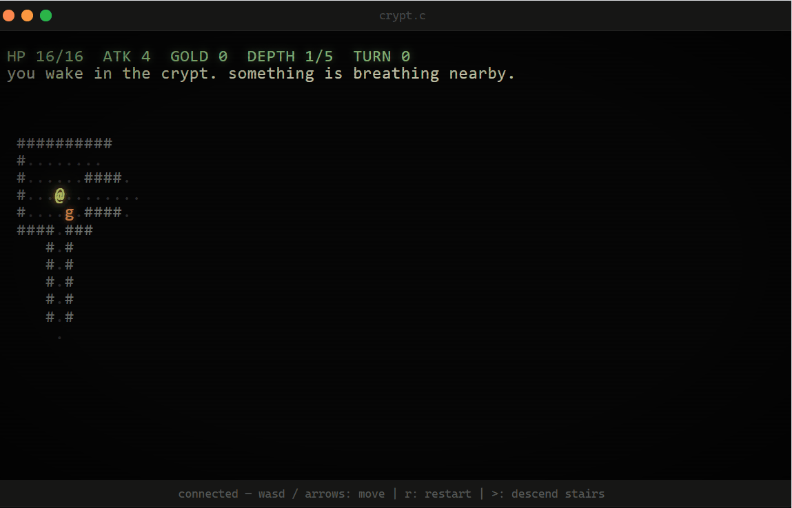

# crypt.c

> a turn-based dungeon crawler that lives entirely on a server written in C.
> no framework. no game engine. no runtime. no JavaScript framework. one
> binary. ~1100 lines. you point a browser at it and the dungeon shows up.



The browser is a `<pre>` tag in a fake terminal window. That's the entire
frontend. Every keypress is a `fetch()`. Every frame is a Server-Sent Event.
Sessions are a cookie pointing at a `GameState` struct in a fixed-size array.
If the server reboots, you die. That's roguelike-correct.

 ## Live demo

  [crypt-f7ji.onrender.com/](https://crypt-f7ji.onrender.com/)

  hosted on Render's free tier. limitations:

  - **cold starts**: if nobody's visited in the last 15 minutes, the server is
    asleep. the page will stare at you for 30–60 seconds, then the dungeon
    appears. this is normal. wait.
  - **server restarts = everyone dies**: Render spins the instance down on
    inactivity and back up on the next visit. when that happens, all sessions
    wipe. this is actually correct roguelike behavior.
  - **512 MB RAM, shared CPU**: one instance, no autoscaling. if it's down it's
    probably getting hammered by someone. try again in a minute.
  - **no persistent storage**: nothing is saved. ever. on purpose, but also
    because the free tier has no disk.

## Questions from people who don't get it yet

**Why does it look like that?**
It's ASCII art in a `<pre>` tag dressed up as a terminal window. This is
intentional. Roguelikes have looked like this since 1980 — Rogue, NetHack,
Angband, all of them. The CRT scanlines, phosphor glow, and fake macOS chrome
are pure CSS — no library, no framework, no build step. The point of this
project is the server, not the frontend. If I wanted a pretty UI I'd have used
a game engine, and then there'd be nothing interesting to look at.

**Why is there input lag?**
Every keypress makes an HTTP request to the server, waits for it to come back,
and then the SSE stream pushes a new frame. You are playing a turn-based game
over HTTP. The lag is the speed of light plus your network RTT. The game is
turn-based on purpose — nobody presses keys faster than the network.

**It stopped updating / the dungeon froze.**
The SSE connection dropped. Refresh the page. Your session is still alive
server-side (it's a cookie). You'll reconnect and pick up where you left off,
unless the server restarted, in which case you're dead. That's a feature.

**I pressed a key and nothing happened.**
Click the dungeon first so it has keyboard focus. The controls are in the
status bar at the bottom of the page.

**Why does `r` restart instead of doing something obvious?**
It's the restart key. You press it when you die. It is labeled in the status
bar. The dungeon also tells you to press it when you die.

**Why can't I save my progress?**
Permadeath. It's a roguelike. This is not a bug. If the server restarts while
you're playing, that counts as a dungeon collapse and you die. This is
also not a bug.

**Why doesn't it work in [browser]?**
It works in Chrome. Other browsers might not work (dont know why). The frontend is ~120 lines
of HTML/CSS/JS with no dependencies. If it doesn't work, open the console and
tell me what's broken.

**Why is the map different every time / every floor?**
The dungeon is procedurally generated. Every floor is built fresh by a BSP
algorithm — it recursively splits the map into rectangles, carves a room in
each leaf, then connects siblings with L-shaped corridors. The seed comes from
`/dev/urandom`, so no two floors are the same run-to-run. When you descend
stairs the seed is scrambled so consecutive floors don't repeat each other
either. This is also just how roguelikes work. It's a genre convention from
1980. Rogue, NetHack, Angband — all of them generate a new dungeon every run.

**Why can't I see the whole map? Why are parts dark?**
Field of view. The server runs a shadowcasting algorithm from your position
every turn — you can see tiles within a radius of 8 that aren't blocked by
walls. Tiles you've visited before show up dimmed but empty (no enemies). Tiles
you've never seen are blank. Enemies only appear when you can currently see
them, which means something can be one tile around a corner and you won't know
it's there until you step into its line of sight. This is also a genre
convention, not a rendering glitch. It's the whole point — the dungeon is
supposed to be unknown.

## Why

Because we could.

## Why for real

I wanted to know how much of "the modern web stack" is actually load-bearing
and how much is theatre. Turns out you can deliver an interactive,
real-time, multi-user web app with:

- raw POSIX sockets (`socket`/`bind`/`accept`/`read`/`write`)
- a hand-rolled HTTP/1.1 parser (`strstr`, `sscanf`, no joke)
- Server-Sent Events written by hand on top of chunked transfer
- the browser's built-in `EventSource` and `fetch`
- a `<pre>` tag

No `node_modules`. No `package.json`. No bundler. No CSS-in-JS.
No SSR. No edge function. No SDK. `make`. Done.

---

## Architecture

This section exists because I wanted to write it, not because you asked.

### Request lifecycle

```
browser
  │ TCP connect
  ▼
accept()  →  pthread_create (detached)
               │
               ▼
           read() into 8KB buffer until "\r\n\r\n"
               │
               ▼
           parse: strchr for spaces in request line → method + path + query
                  walk header lines with strstr("\r\n") → grab Cookie, User-Agent
               │
               ▼
           router_dispatch()
               │
        ┌──────┴──────────────────────────┐
        │                                 │
   one-shot routes                  GET /game
   (/, /input, /restart,          SSE handler:
    /healthz)                      write headers → loop {
        │                            nanosleep(100ms)
   write response                    lock session
   close fd                          if version changed → render + write frame
                                      else if idle > 15s → write ": ping"
                                     unlock session
                                    }  ← exits on write() EPIPE
```

### SSE framing

SSE is just `Content-Type: text/event-stream` with a very specific text
format. Each event is one or more `data: <line>` lines followed by a blank
line. The browser's `EventSource` fires `onmessage` with those data fields
joined by `\n`.

The dungeon map has newlines in it — one per row. You can't put a raw `\n`
inside a `data:` field. Solution: each map row becomes its own `data:` line.
The EventSource joins them with `\n`, so `innerHTML = e.data` gives you
the entire pre-formatted dungeon in one shot.

```
data: <span class="hud">HP 14/16 ...</span>
data: <span class="wall">#</span><span class="floor">.</span>...
data: <span class="wall">#</span><span class="player">@</span>...
data:
     ^ blank line → EventSource fires onmessage
```

We also write `retry: 2000` at stream open (tells the browser to reconnect
after 2s if it dies) and a `: ping` comment every 15s idle so reverse
proxies don't time out the connection.

### Sessions

256 slots. Fixed array. No allocator. One `pthread_mutex_t` per slot.

On first `/game` hit with no cookie: scan for a free slot; if all 256 are
full, evict the one with the oldest `last_used_ms` (LRU). Generate a 32-char
SID from `/dev/urandom`, allocate a `GameState`, set a 1-day cookie, return
the session pointer. Subsequent requests scan the table for matching SID under
the global table mutex, then hand back the slot pointer.

State changes go through the slot's own mutex. The SSE handler holds it only
long enough to read the version counter (and render, if changed). `/input`
holds it long enough to call `game_apply_input()` and bump the version.
No condition variables — the SSE thread polls at 100ms. Four lines of code
beats a correct `pthread_cond_broadcast` every time.

### Map generation

BSP. Classic recipe: recursively partition a rect until leaves are small
(min leaf 8×8, max recursion depth 6), carve a randomly-sized room inside
each leaf, then walk back up the tree connecting sibling leaf-centers with
L-shaped corridors. Then a wallify pass: any `TILE_VOID` adjacent to
`TILE_FLOOR` becomes `TILE_WALL`.

RNG is xorshift32 seeded from `/dev/urandom`. The same seed generates the
same dungeon. Each floor uses `seed ^ 0x9e3779b9` (Knuth's Fibonacci hashing
constant) so floors don't repeat.

Stairs placement: try 200 random floor tiles, pick the one farthest from the
player start (euclidean squared). Enemies scale with depth: `4 + depth`
goblins, `depth` orcs. Items: 2 potions + `3 + depth` gold piles.

### Field of view

Bjorn-Bergstrom's recursive shadowcasting, 8 octants, radius 8. The
implementation is ~65 lines. Three visibility states per tile:

- `VIS_HIDDEN` — never seen. Renders as `&nbsp;`.
- `VIS_EXPLORED` — seen before, not currently visible. Renders dimmed (`.dim`).
- `VIS_VISIBLE` — in current FOV. Renders with full color + entities on top.

Enemies only appear on `VIS_VISIBLE` tiles. No tracking through fog.

### Render

`render_frame_html()` allocates a buffer (starts 16KB, doubles as needed),
walks the map row by row, emits one character per tile wrapped in
`<span class="classname">`. Entities override the tile's class/glyph at their
position. `<`, `>`, `&`, and spaces get HTML-escaped. Two HUD lines go above.
The returned pointer is owned by the caller; caller `free()`s it after
writing to the SSE stream. CSS classes are in the embedded `index.html`.
The C code doesn't know or care what the colors are.

### Game logic

Turn-based. The world only ticks when the player presses a key.

Player turn order:
1. Interpret key (move / wait / descend / restart)
2. If moving into an enemy tile: bump-attack (player ATK ± 1 random)
3. If stepping onto gold or potion: auto-pickup
4. Enemy turns: for each living enemy in `VIS_VISIBLE`, step toward player
   (try diagonal first, then axis-aligned), attack on adjacency
5. Recompute FOV

Enemies don't path through fog. They chase when they can see you and wait
when they can't. The AI is about 35 lines.

### Concurrency

One detached pthread per accepted connection. The main thread just `accept()`s
forever. SIGPIPE is ignored at startup; broken pipe surfaces as `EPIPE` from
`write()`, which terminates the SSE loop cleanly. Thread-safety is two
mutexes: one global table lock (held briefly for session lookup/creation) and
one per-session lock (held during state mutation and rendering).

### Build

```
make
```

Three steps:
1. `xxd -i static/index.html > src/static_html.h` — embeds the frontend as
   a C byte array. Linked into the binary. Zero file I/O at runtime.
2. `gcc -O2 -Wall -pthread -std=c11` on the 8 source files.
3. Link into `build/crypt`.

No dependencies beyond libc and libpthread.

---

## What's in here

```
crypt/
├── src/
│   ├── main.c        arg parsing, SIGPIPE suppression, server_start()
│   ├── server.c      socket/bind/accept/pthread, request parser, response helpers
│   ├── router.c      path matching, session resolution, SSE loop, input dispatch
│   ├── game.c        turn logic, bump combat, item pickup, enemy AI, win/death
│   ├── map.c         BSP generator, xorshift32, corridor carving, enemy placement
│   ├── fov.c         recursive shadowcasting, 8 octants
│   ├── render.c      GameState → heap-allocated HTML chunk
│   └── session.c     256-slot cookie-keyed session table, LRU eviction
├── static/
│   └── index.html    the entire frontend (~120 lines including CSS)
├── Makefile
├── Dockerfile        multi-stage: gcc builder → debian:slim runtime
└── README.md         (you are here)
```

---

## How to run it

### locally

```sh
make && ./build/crypt --port 8080
```

Needs: `gcc` (or `clang`), `make`, `xxd`, pthreads. Any Linux or macOS
machine made in the last decade has these.

### in Docker

```sh
docker build -t crypt .
docker run --rm -p 8080:8080 crypt
```

### behind a reverse proxy

Caddy:

```Caddyfile
crypt.example.com {
    reverse_proxy localhost:8080 {
        flush_interval -1   # don't buffer SSE
    }
}
```

nginx needs `proxy_buffering off` and `proxy_read_timeout` bumped, or SSE
keepalives get eaten by the default buffer.

### on a $5 VPS

```sh
scp build/crypt root@vps:/usr/local/bin/crypt
```

systemd unit:

```ini
[Service]
ExecStart=/usr/local/bin/crypt --port 8080
Restart=always
[Install]
WantedBy=multi-user.target
```

`systemctl enable --now crypt`. Put Caddy in front. Share the link.

---

## Controls

| key                | action                                          |
|--------------------|-------------------------------------------------|
| `w` `a` `s` `d`    | move (also: arrow keys, vim `hjkl`)             |
| `.` / `space`      | wait one turn                                   |
| `>`                | descend stairs (when standing on `>`)           |
| `r`                | restart after death                             |

## Glyphs

| glyph | meaning      |
|-------|--------------|
| `@`   | you          |
| `g`   | goblin       |
| `o`   | orc          |
| `#`   | wall         |
| `.`   | floor        |
| `+`   | door         |
| `>`   | stairs down  |
| `!`   | potion       |
| `$`   | gold         |

---

## FAQs

**Why C?**
Because it makes the whole thing funnier. In Go this would be mildly
interesting. In Rust it would be a blog post. In C it's a troll project.

**Why not use libevent / libuv / nghttp2?**
The entire point is the HTTP server. If you hand that off to a library you've
written a thin wrapper and the bit stops working.

**Why `pthread_create` per connection instead of a thread pool or `epoll`?**
A thread pool needs a work queue and a condition variable, which is 80 lines.
`epoll` needs non-blocking I/O and a state machine per fd, which is 300 lines.
We have maybe 30 concurrent connections on a good day. The OS scheduler is
fine. The bottleneck is the player's fingers.

**Why is the HTTP parser `strstr` and pointer arithmetic?**
Because it works. The request arrives in one buffer; we find the request line
by scanning for spaces, walk headers with `strstr("\r\n")`, extract the two
fields we care about (Cookie, path). It is not RFC 9110 compliant. It doesn't
need to be.

**Why GET for `/input` instead of POST?**
`fetch('/input?key=w')` is shorter than a POST with a body. We don't need
idempotency semantics. The HTTP method police have not filed a complaint.

**Why cookies for session identity and not a URL parameter?**
So refreshing the page doesn't mint a new session. A query param in the page
URL disappears on reload. A cookie comes back on every request automatically.
That's literally what cookies are for.

**Why poll the version counter at 100ms instead of a `pthread_cond_broadcast`?**
Condition variables require the waiter to hold the mutex at sleep, release it
on wakeup, handle spurious wakeups, and the broadcaster to hold the mutex
when it signals. That's a page of code and three subtle correctness
requirements. This is a turn-based game. Nobody presses keys faster than
100ms. The latency is imperceptible.

**Why 256 sessions?**
It's a power of two and I needed a number. Each `GameState` is a few KB;
the whole table fits comfortably. If you have 256 simultaneous users on a
free-tier instance you have a different category of problem than session limits.

**Why LRU eviction instead of TTL-based expiry?**
TTL requires a background thread or checking timestamps on every scan.
LRU triggers only when you actually need a slot. Since server restarts wipe
everything anyway, the practical difference is zero.

**Why `/dev/urandom` for session IDs instead of `rand()`?**
Because `rand()` seeded from time is guessable and a 256-slot table is
enumerable in under a second. Session IDs are a trust boundary; use the
OS CSPRNG.

**Why SSE and not WebSockets?**
SSE is HTTP. `Content-Type: text/event-stream`, a text frame format, done.
WebSockets is a separate protocol with an upgrade handshake, a
Sec-WebSocket-Key/Accept SHA-1 dance, and a binary frame format with opcodes
and masking. That's ~200 more lines of C I didn't want to read again. SSE is
fine for a game that only pushes frames server-to-client.

**Why emit HTML spans from the server instead of ANSI codes?**
ANSI codes render in terminals. Browsers don't have a terminal emulator.
Options: (a) ship a JS terminal emulator, which is a dependency; (b) parse
ANSI in the frontend, which is 100 lines of JS; (c) emit CSS-classed spans
from the server, which is 10 lines of C. We went with (c).

**Why no HTTP/1.1 keep-alive on non-SSE routes?**
Keep-alive means tracking whether the client signaled `Connection: close`,
reading the next request off the same fd after writing the response, and
handling idle timeouts. That's a small state machine. One TCP connection per
request costs a negligible amount of latency that browsers don't notice
because they pipeline connections.

**Why no saves? Why permadeath?**
Saves require serialization. Serialization requires a format. A format
requires a parser and error handling. Also permadeath is on the brand.
The server rebooting counts as a dungeon collapse. That's a feature.

**Isn't this slow?**
It's a turn-based game. The bottleneck is your fingers.

**Won't this fall over with many connections?**
Yes. `pthread_create` per connection, no thread pool, no `epoll`. Don't put
it on Hacker News.

**Is the parser secure?**
It's bounded — 8KB read buffer, `snprintf` everywhere, fixed-size field
buffers. That's "probably doesn't segfault on inputs I tested," not "audited."
Treat it accordingly.

**Will it run on Windows?**
No. `socket`/`bind`/`accept`/`pthread`/`/dev/urandom` are POSIX. WSL works.

---

## What I deliberately didn't do

- HTTP/1.1 keep-alive on non-SSE routes.
- Compression, ETags, conditional requests, content negotiation.
- Graceful shutdown of in-flight SSE streams on `SIGINT`. It's a war crime.
- TLS. Use Caddy or Cloudflare; I'm not parsing X.509 by hand for a bit.
- Saves. Permadeath.
- A test suite. The `<pre>` tag is the test suite.
- Thread pool, epoll, io_uring.
- Input validation beyond "doesn't segfault."

---

## Acknowledgements

The shadowcasting is the Bjorn-Bergstrom recipe from roguebasin. The BSP
recipe is also roguebasin's. xorshift32 is Marsaglia's. The Fibonacci hashing
constant is Knuth's. Everything else is original sin.

## License

MIT. If you ship this in production you have problems I cannot help with.
